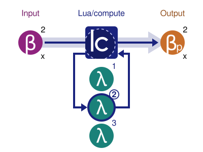

# Lua/compute

The Lua/compute C library facilitates the use of [Lua][lua] programs as compute
contexts. A compute context is a set of functions that all accept byte array
arguments, and return byte array results. In Lua/compute, these functions are
referred to as *lambdas*, and the byte array input/output values are called
*batches*. One could think of Lua/compute as one big function, that takes
batches and lambda identifiers as input, and return processed batches as
output, as illustrated by the below diagram.

[lua]: http://www.lua.org/



## Examples

TODO

Read more about the Lua/compute C API [here](src/main/c/lcm.h).

## Building and Installing

The library requires LuaJIT 2.0 headers to be available to build the library,
and the LuaJIT 2.0 library if building the test suite. Building is done using
GNU Make from the repository root directory, as shown below.

```bash
$ make all
```

OS X users should note that it is assumed that all libraries and headers are
available via the `/usr/local` prefix. The prefix is used by [Homebrew][brew],
which provides a convenient way to install the required headers and libraries.

[brew]: http://brew.sh/

### Using Regular Lua 5.1

If wishing to build using regular Lua 5.1, the below example commands could be
used to force its usage.

#### Linux (Ubuntu 14.04)

```bash
$ make all CFLAGS="-std=c99 `pkg-config --cflags lua5.1`" \
    LDFLAGS="`pkg-config --libs-only-L lua5.1`" \
    LIBS="`pkg-config --libs-only-l lua5.1`"
```

#### Mac OS X (10.11 El Capitan)

```bash
$ make all CFLAGS="-std=c99 -I/usr/local/include/lua-5.1" \
    LDFLAGS="-L/usr/local/lib" LIBS="-llua5.1"
```

## Limitations

The library provides no networking utilities whatsoever, despite that the
intended use case was for the library to be used for distributed computations.
The reason for this is to make the library as portable as possible, and to not
limits its use to distributed applications.

## Contributing

Bug fixes and minor enhancements are most appreciated. If wanting to add some
more significant functionality, please create a question issue and discuss it
first.

All contributions are expected to adhere to the code style and conventions
adhered to by the project.

All code was written using the Atom editor using the plug-ins `clang-format`,
`autocomplete-clang`, `docblockr`, `linter` and `linter-clang`. The repository
already contains the proper configuration files for these plug-ins to work out
as intended.
